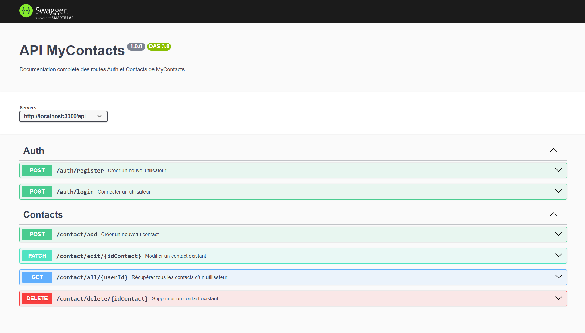

# MyContacts API

[](https://react.dev/)
[](https://nodejs.org/)
[](https://expressjs.com/)
[](https://www.mongodb.com/)
[](http://localhost:8080)


API de gestion de contacts sécurisée construite avec **Express**, **MongoDB** et **JWT**.  
Elle permet à un utilisateur de créer un compte, se connecter et gérer ses contacts (CRUD complet).

---

## 1. Installation

Clone le dépôt et installe les dépendances :

```bash
git clone https://github.com/VasileLeBoss/MyContacts.git
cd MyContacts

cd ./backend
npm install

cd ./frontend
npm install

```

Crée un fichier `.env` à la racine :

```env
NODE_ENV=
PORT=
MONGODB_URI=
JWT_SECRET=
```

---


## 2. Endpoints

### `/api/auth/register`

```http
POST /api/auth/register
```
**Body exemple :**
```json
{
  "firstName": "John",
  "lastName": "Doe",
  "email": "john.doe@example.com",
  "password": "mypassword123"
}
```

### `/api/auth/login`

```http
POST /api/auth/login
```
**Body exemple :**
```json
{
  "email": "john.doe@example.com",
  "password": "mypassword123"
}
```

**Réponse :**
```json
{
  "token": "eyJhbGciOiJIUzI1NiIsInR5cCI6IkpXVCJ9...",
  "user": {
    "id": "66e8f0...",
    "firstName": "John",
    "email": "john.doe@example.com"
  }
}
```

---

### `/api/contact/all/:userId`

```http
GET /api/contact/all/:userId
Authorization: Bearer <token>
```

**Réponse exemple :**
```json
{
  "contacts": [
    {
      "firstNameContact": "Alice",
      "lastNameContact": "Dupont",
      "phoneNumberContact": "0612345678"
    }
  ]
}
```

**Capture attendue :**  


---

### `/api/contact/add`

```http
POST /api/contact/add
Authorization: Bearer <token>
```
**Body exemple :**
```json
{
  "userId": "66e8f0...",
  "firstNameContact": "Bob",
  "lastNameContact": "Martin",
  "phoneNumberContact": "0622334455"
}
```

**Capture attendue :**  


---


## 3. OpenAPI + Swagger

- OpenAPI YAML → `./swagger/swagger.yaml`  
- Swagger UI → [http://localhost:8080](http://localhost:8080)  
- Validation OpenAPI : via [Swagger Editor](https://editor.swagger.io/) ou `swagger-cli validate swagger.yaml`

**Capture Swagger UI :**  


---

## 4. Livrables

| # | Branch | Contenu attendu |
|---|--------|----------------|
| 01 | `feature/auth` | Inscription / Connexion fonctionnelles |
| 02 | `feature/contacts` | CRUD complet des contacts |
| 03 | `feature/swagger` | Documentation Swagger complète |

---

## 5. Notes

- Authentification par **JWT Bearer**  
- Middleware de vérification du token sur toutes les routes `/api/contact/*`  
- Swagger auto-généré à partir de `swagger.yaml`  
